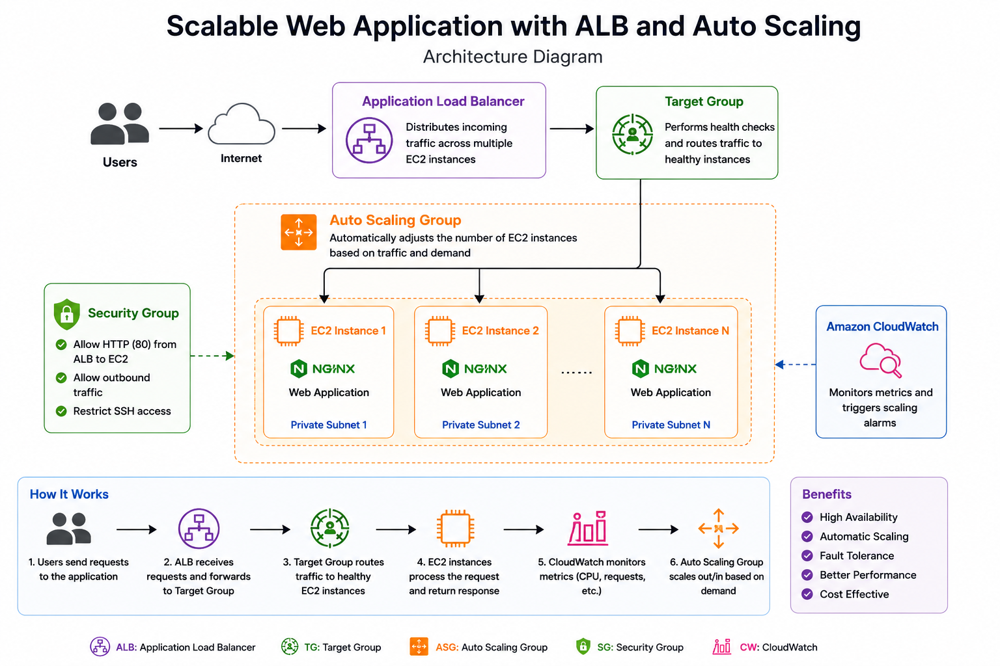
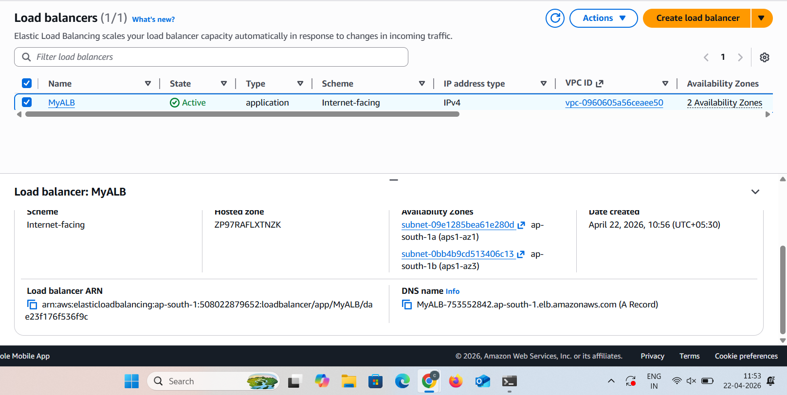
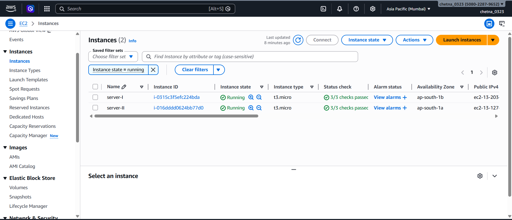
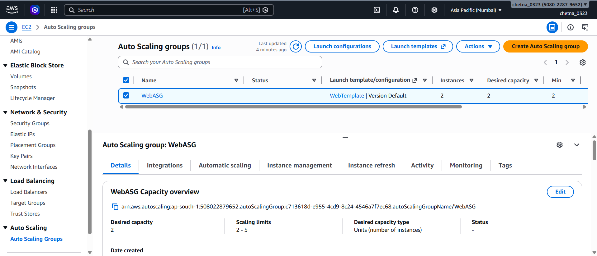
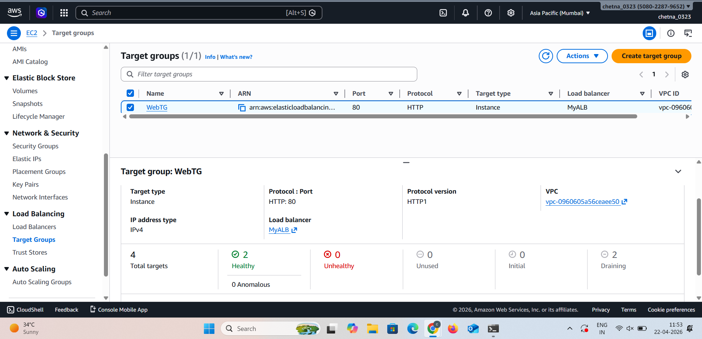
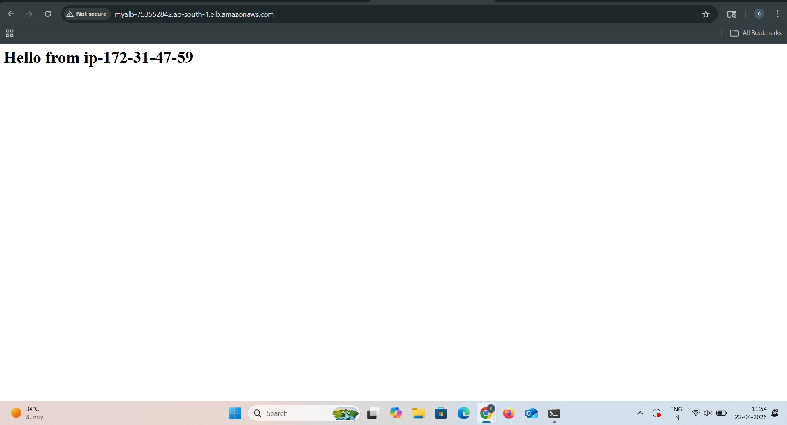

🚀 Scalable Web Application using ALB & Auto Scaling


---

📌 Project Overview

This project demonstrates how to build a **highly scalable and highly available web application** using AWS services.

The application can automatically handle increasing traffic by distributing load across multiple EC2 instances using an **Application Load Balancer (ALB)** and scaling instances dynamically using an **Auto Scaling Group (ASG)**.

---

🎯 Purpose

* Handle high traffic automatically
* Avoid server crashes
* Ensure high availability
* Distribute load efficiently

---

🧰 AWS Services Used

* Amazon EC2
* Application Load Balancer (ALB)
* Auto Scaling Group (ASG)
* Security Groups

---

🏗️ Architecture Diagram



**Flow:**

User → ALB → Target Group → EC2 Instances (Auto Scaling)

---

⚖️ Application Load Balancer



The ALB distributes incoming traffic across multiple EC2 instances, ensuring no single server is overloaded.

---

🖥️ EC2 Instances



Multiple EC2 instances are running the application and are registered with the target group.

---

📊 Auto Scaling Group



Auto Scaling automatically maintains the desired number of EC2 instances and scales based on traffic.

---

🎯 Target Group



The target group manages and monitors EC2 instances and performs health checks.

---

🌐 Application Output



This shows the application being accessed via the Load Balancer DNS, confirming proper load distribution.

---

🔥 Key Features

* Load balancing using ALB
* Automatic scaling using ASG
* High availability architecture
* Fault tolerance
* Health monitoring using Target Groups

---

📁 Project Structure

```
Scalable-Web-App-ALB-ASG/
│── index.html
│── README.md
│── screenshots/
│    ├── alb.png
│    ├── ec2.png
│    ├── asg.png
│    ├── target-group.png
│    ├── output.png
│    ├── architecture.png
```

---

🧠 How It Works

1. User sends request
2. ALB receives request
3. ALB forwards request to target group
4. Target group selects healthy EC2 instance
5. Auto Scaling adds/removes instances based on traffic

---

✅ Conclusion

This project demonstrates how AWS services like **ALB and Auto Scaling** can be used to build a **scalable, reliable, and production-ready web application architecture**.
